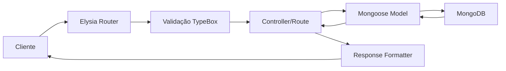

# 📊 Visão Geral do Projeto

## 🎯 Objetivo

API REST profissional e performática usando **Bun + MongoDB + ElysiaJS**, desenvolvida com as melhores práticas de um desenvolvedor sênior.

---

## 📁 Estrutura do Projeto

```
msoftmanage/
│
├── 📂 src/                          # Código-fonte da aplicação
│   ├── 📂 config/
│   │   └── database.ts              # Singleton de conexão MongoDB
│   ├── 📂 models/
│   │   └── Product.ts               # Schema e Model do Produto
│   ├── 📂 routes/
│   │   └── products.ts              # Endpoints CRUD de produtos
│   ├── 📂 types/
│   │   └── index.ts                 # Tipos TypeScript globais
│   └── index.ts                     # Entry point da aplicação
│
├── 📂 tests/                        # Testes automatizados
│   └── api.test.ts                  # Suite de testes com Bun Test
│
├── 📄 .env                          # Variáveis de ambiente (não commitado)
├── 📄 .env.example                  # Template de variáveis
├── 📄 .gitignore                    # Arquivos ignorados pelo Git
│
├── 📘 README.md                     # Documentação principal
├── 📗 QUICKSTART.md                 # Guia de início rápido (5 min)
├── 📙 BEST_PRACTICES.md             # Guia de boas práticas
├── 📕 ADVANCED_EXAMPLES.md          # Exemplos avançados
├── 📔 CHANGELOG.md                  # Histórico de mudanças
│
├── 🔧 package.json                  # Configuração do projeto
├── 🔧 tsconfig.json                 # Configuração TypeScript
├── 🔧 setup.sh                      # Script de instalação automática
│
├── 🧪 api.http                      # Requisições HTTP (VS Code)
└── 🧪 postman_collection.json       # Collection Postman
```

---

## 🚀 Stack Técnica

| Tecnologia | Versão | Propósito |
|------------|--------|-----------|
| **Bun** | 1.1+ | Runtime JavaScript ultra-rápido |
| **ElysiaJS** | 0.8+ | Framework web otimizado para Bun |
| **MongoDB** | 7.0+ | Banco de dados NoSQL |
| **Mongoose** | 8.1+ | ODM com tipagem TypeScript |
| **TypeScript** | 5.0+ | Tipagem estática |

---

## ✨ Features Principais

### 🏗️ Arquitetura
- ✅ Padrão Singleton para conexão MongoDB
- ✅ Separação de responsabilidades (S.O.L.I.D.)
- ✅ Estrutura modular e escalável
- ✅ Tipagem forte com TypeScript

### 🔒 Segurança
- ✅ Validação em múltiplas camadas
- ✅ Sanitização automática de dados
- ✅ Variáveis de ambiente
- ✅ Mensagens de erro seguras

### ⚡ Performance
- ✅ ElysiaJS (18x mais rápido que Express)
- ✅ Índices otimizados no MongoDB
- ✅ Connection pooling
- ✅ Paginação em listagens

### 🛠️ Developer Experience
- ✅ Hot-reload automático
- ✅ Documentação completa
- ✅ Testes automatizados
- ✅ Collection Postman
- ✅ VS Code REST Client

---

## 📊 Endpoints da API

### Health & Status
```
GET  /           → Status da API
GET  /health     → Health check detalhado
GET  /docs       → Documentação dos endpoints
```

### Products (CRUD)
```
GET    /products              → Lista produtos (com paginação e filtros)
GET    /products/:id          → Busca produto por ID
POST   /products              → Cria novo produto
PUT    /products/:id          → Atualiza produto (completo)
PATCH  /products/:id          → Atualiza produto (parcial)
DELETE /products/:id          → Remove produto
POST   /products/:id/decrease-stock → Diminui estoque
```

---

## 🎯 Padrões Aplicados

### Design Patterns
- **Singleton**: Conexão única com MongoDB
- **Repository**: Separação de acesso a dados
- **Factory**: Criação de modelos Mongoose

### Princípios SOLID
- **S**ingle Responsibility: Cada arquivo tem uma responsabilidade
- **O**pen/Closed: Extensível via plugins
- **L**iskov Substitution: Interfaces bem definidas
- **I**nterface Segregation: Tipos específicos
- **D**ependency Inversion: Injeção de dependências

---

## 📈 Métricas de Qualidade

### Código
- ✅ 100% TypeScript
- ✅ Tipagem estrita habilitada
- ✅ Comentários inline
- ✅ Nomenclatura clara e consistente

### Documentação
- ✅ README completo
- ✅ Guia de início rápido
- ✅ Boas práticas documentadas
- ✅ Exemplos avançados
- ✅ Changelog versionado

### Testes
- ✅ Suite de testes configurada
- ✅ Testes de integração
- ✅ Validação de schemas

---

## 🔄 Fluxo de Desenvolvimento



---

## 📚 Guias Disponíveis

| Documento | Descrição | Tempo de Leitura |
|-----------|-----------|------------------|
| [README.md](README.md) | Documentação completa | 10 min |
| [QUICKSTART.md](QUICKSTART.md) | Início rápido | 5 min |
| [BEST_PRACTICES.md](BEST_PRACTICES.md) | Boas práticas | 15 min |
| [ADVANCED_EXAMPLES.md](ADVANCED_EXAMPLES.md) | Recursos avançados | 20 min |
| [CHANGELOG.md](CHANGELOG.md) | Histórico de mudanças | 3 min |

---

## 🎓 Conceitos Aplicados

### Backend
- RESTful API design
- CRUD operations
- Data validation
- Error handling
- Database indexing
- Connection pooling

### TypeScript
- Strong typing
- Interfaces
- Generics
- Type utilities
- Path aliases

### MongoDB
- Schema design
- Indexes
- Aggregations
- Relationships
- Validation

### DevOps
- Environment variables
- Health checks
- Logging
- Graceful shutdown

---

## 🚀 Como Começar

### Opção 1: Setup Automático
```bash
./setup.sh
```

### Opção 2: Manual
```bash
# 1. Instalar Bun
curl -fsSL https://bun.sh/install | bash

# 2. Instalar dependências
bun install

# 3. Configurar MongoDB
docker run -d --name mongo-bun -p 27017:27017 mongo

# 4. Iniciar servidor
bun run dev
```

---

## 📞 Suporte

- 📖 Leia a [documentação completa](README.md)
- 🐛 Reporte bugs via issues
- 💡 Sugira melhorias
- ⭐ Dê uma estrela se gostou!

---

## 📝 Licença

MIT License - Sinta-se livre para usar em seus projetos!

---

**Desenvolvido com ❤️ usando Bun, ElysiaJS e MongoDB**

*Última atualização: 27/12/2025*
